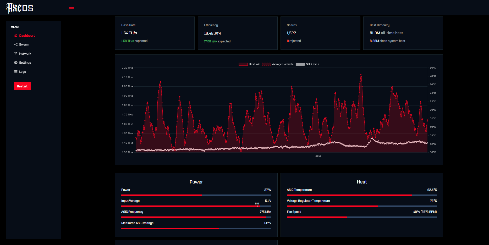

AxeOS is the software that powers every [BitAxe](/bitaxe/about) so far. It instructs the ESP microcontroller inside the BitAxe how to speak to its mining ASIC and it hosts a Configuration-UI right on the BitAxe itself. This makes it possible to control and monitor your BitAxe through a Webbrowser.

This firmware is designed to run on a BitAxe v2+

