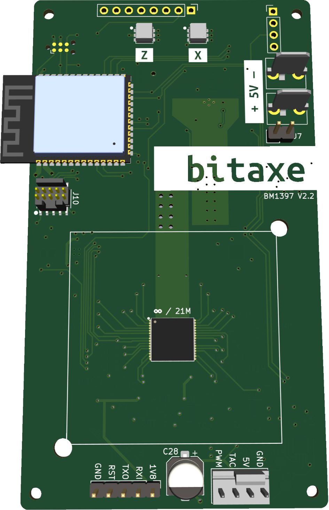

The BitaxeMax is the world's first open source Bitcoin Miner which uses the ASIC BM1397 chip to achieve astonishing results.

## What is this?

The Bitaxe Max is a groundbreaking open-source Bitcoin standalone miner, representing a significant leap in mining technology. At its core, it employs an ASIC 1397 chip, a specialized application-specific integrated circuit designed for optimal Bitcoin mining performance. Adding to its innovative features, the Bitaxe Max is equipped with an ESP32-S3, serving as the brain of the miner and facilitating seamless connectivity to Wi-Fi networks.

One of the key strengths of the Bitaxe Max lies in its impressive hash rate range, boasting speeds between 250-450 giga hashes per second (Gh/s) while just using up to 15 watts. This high level of computational power allows for efficient and competitive Bitcoin mining, contributing to the overall security and decentralization of the network.

With its open-source nature, the Bitaxe Max not only provides cutting-edge mining capabilities but also encourages transparency and collaboration within the cryptocurrency community. This unique combination of advanced hardware, open-source philosophy, and substantial hash rate positions the Bitaxe Max as a noteworthy player in the world of Bitcoin mining.

## 🔋 Features

- **ESP32-S3-WROOM-1** wifi microcontroller on board
- **TI TPS40305** buck regulator steps down the 5V input to power the BM1397
- **Maxim DS4432U+** current DAC digitally adjusts the BM1397 core voltage from 0.04V to 2.4V
- **TI INA260** power meter measures the input voltage and current of the miner
- **Microchip EMC2101** measures the BM1397 internal diode temperature. Also, PWM controls the fan and monitors tach output.
- Two **sweet** RGB status LEDs

## 🛠️ Hardware

The Bitaxe in general uses an <b>ESP32-S3-WROOM-1</b> to operate the whole device. This microcontroller uses a specifically written Software to serve as the Brain of this operation. It does the handling of the job functions of the ASIC and it allows to connect to the Internet over Wi-Fi.

## ⚙️ Guide

The BitaxeMAX can be either purchased as a fully functional standalone Bitcoin miner, or you can build your own with the following guides in [Assembly](assembly.md) and [Building](building.md). Building this on your own will take much longer and requires a high skillset of SMD soldering and handling.

### Building

1. Building and Assembly

   - These two readme files will guide you throu the process of whats needed to build and order your own BitaxeMAX board.
     - [Assembly-readme](assembly.md)
     - [Building-readme](building.md)
   - There are some Videos and Streams about how to Assembly a Bitaxe from scratch from some YouTubers such as [D-Central](https://www.youtube.com/@DCentralTech) and [WantClue](https://www.youtube.com/@WantClue)

2. Schematics

   - Furthermore, for a more detailed view of the schematics of the BitaxeMAX board, you can view [BitaxeMaxSchematic](/doc-assets/bitaxe/bitaxeMax_schematic.pdf).

3. Manufacturing Files
   - In the [Manufacturing_Files_Folder](Manufacturing_Files) you will find all the necessary files to create your own PCB from Gerber files and the BOM(Build of Matierial) a list of all the components needed to build the BitaxeMAX

### Software

The BitAxe runs on [AxeOS](/axeos/about). Follow [this guide](/axeos/install-onto-bitaxe) on how to install it onto your BitAxe.

## 🎯 Goals

- [x] Standalone Miner
- [x] Reverse Engineering the Bitmain BM1397
- [ ] Tweak the J/GH efficiency and figure out how far we can go

## 📝 To-Do's

Any open issues will be listed here.
