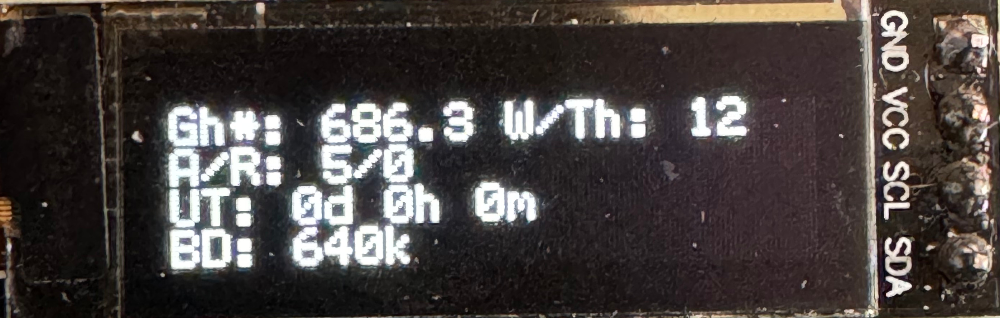

The BitaxeHex is currently a prototype concept and is hardly under development.

## What is this?

The BitaxeHex features all core concepts of it's previous versions and combines the power of four ASIC chips onto one hashboard.

It's current development features a hashrate of roughly 2.7 ~ 3 TH/s at a wall power consumption of roughly about 60 watts.

## 🛠️ Hardware

- [BM1366 from NBTC on AliExpress](https://www.aliexpress.us/item/3256804709142138.html).

The BM1366 is a undocumented SHA256 mining ASIC from Bitmain. It's mostly used in the Antminer S19XP.
Bitmain claims the BM1366 has 0.021J/GH efficiency

### 🖥️ Screens

The BitaxeHex will feature a bigger screen than the current i2c screen which is build into it.

## ⚙️ Guide

## Building

:::caution[This page is not written yet.]
Help us to complete the wiki by using the "Edit page" button at the end of the page 👇
:::
