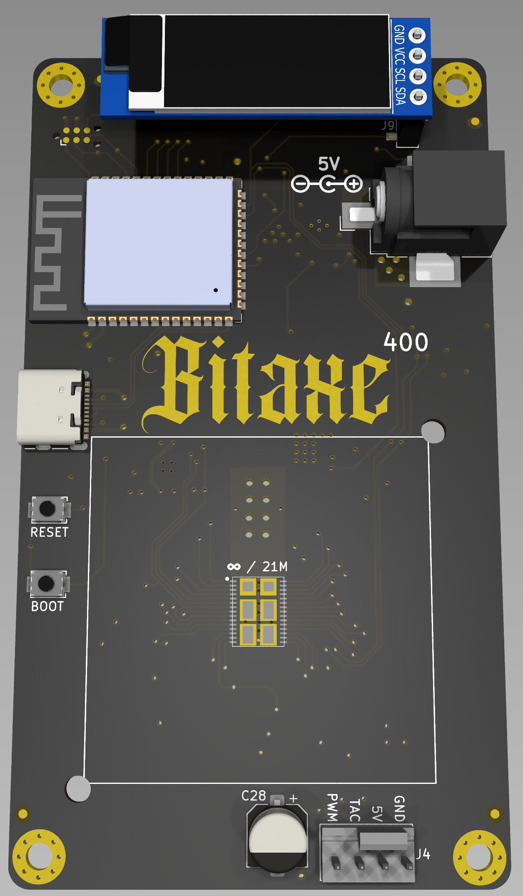

## What is this?

Supra is the 4th major revision of the bitaxe that now includes the BM1368 ASIC from the Antminer S21

## 🛠️ Hardware

- The BM1368 is a undocumented SHA256 mining ASIC from Bitmain. It's used in the Antminer S21
- Bitmain claims the BM1368 has 17.5 J/TH efficiency
- The BM1368 is brand new and isn't available anywhere yet.
- The BM1368 has a different footprint and pinout from the BM1366, BM1397 and BM1387 in previous bitaxe.

## Software

1. Building your Software

   - You can build your own binary files from the source code. For more details follow this [Build-Guide](/axeos/compile).

2. Using a prebuild

   - Every Bitaxe is controlled by the open source available [ESP-Miner](https://github.com/skot/ESP-Miner) software. It features a WebUi for user friendly usage and controlablility.
   - In this repository you will also find a [releases](https://github.com/skot/ESP-Miner/releases) page that will contain prebuild binary files to flash to your Bitaxe using the [Bitaxetool](https://github.com/johnny9/bitaxetool) created by [johnny9](https://github.com/johnny9).

3. Flashing Process
   - The [ESP-Miner](https://github.com/skot/ESP-Miner) Software can be flashed via a USB cable onto the Bitaxe. Therefore you need to follow the initial Guide in the repository.

:::caution[This page is not written yet.]
Help us to complete the wiki by using the "Edit page" button at the end of the page 👇
:::
