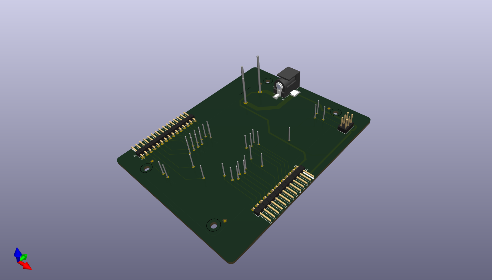

The axeTester is a testing board designed to use the TP's of a Bitaxe and read values from it.

The axeTester is a bed-of-nails style pogo pin tester for bitaxe builders.

- 2.1mm power jack for powering the bitaxe under test.
- 6 pin header for attaching to the esp-prog programmer
- 13 and 15 pin headers for accessing all of the bitaxe test pads
