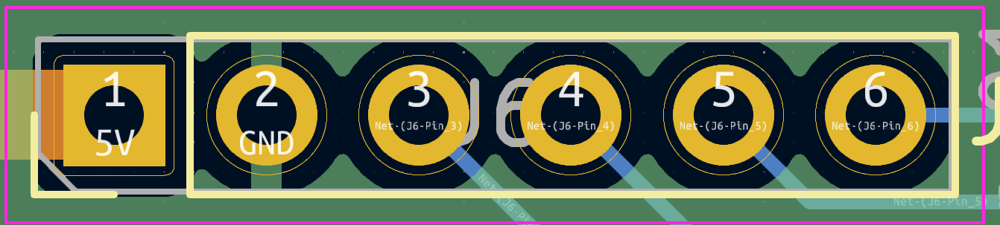

The Bitaxe Accessories Port (BAP) is a serial port for multiple accessories to communicate with the ESP32 on the board.

## What is this?

We're excited to unveil the Bitaxe Accessories Port (BAP), a versatile addition to the Bitaxe board that enhances its connectivity and functionality. Designed with ease of use in mind, the BAP sits conveniently on the top side of the Bitaxe board, providing seamless integration with various accessories.

## Key Features of the BAP

- **Four Serial Ports:** The BAP includes four serial ports, allowing for efficient data communication and integration with multiple accessories simultaneously. This feature is ideal for users who need to connect additional sensors, displays, or other peripherals to their Bitaxe miner.

- **Power and Ground Pin:** The BAP also includes a 5V power pin and a ground (GND) pin, making it simple to power external devices directly from the Bitaxe board. This setup reduces the need for additional power supplies, streamlining your mining rig's design.

- **Compact and Convenient:** Located on the top side of the Bitaxe board, the BAP is easily accessible, making it simple to add or swap accessories as needed. Its compact design ensures that it doesn't interfere with the Bitaxe's primary functions.

## How to Get Started with the BAP

Integrating the BAP into your Bitaxe setup is straightforward. Simply connect your accessories to the appropriate pins on the port. Ensure that your devices are compatible with the 5V power supply provided by the BAP. For detailed instructions and diagrams, refer to the Bitaxe documentation available on our [GitHub page](https://github.com/skot/bitaxe) and [official website](https://bitaxe.org/).
