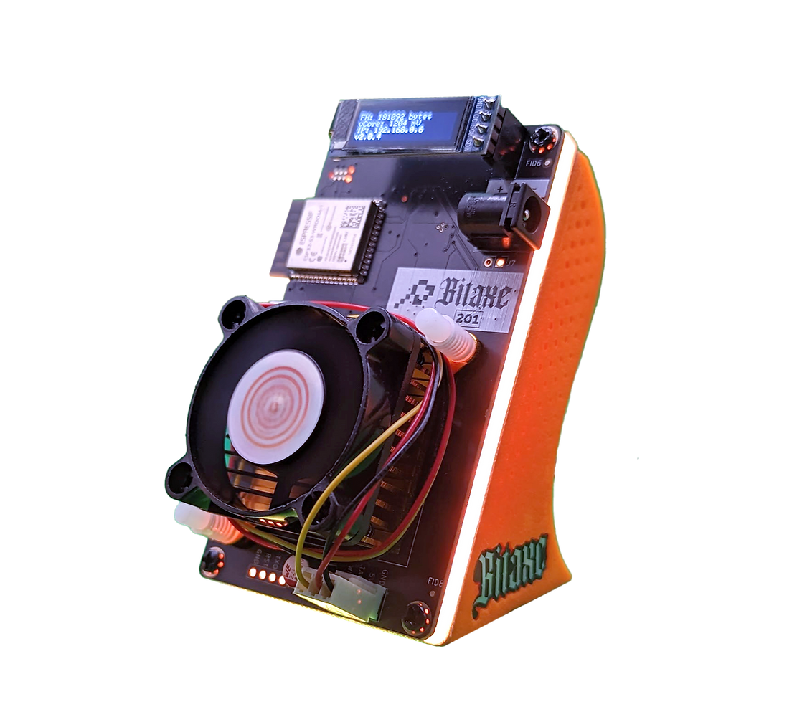

# The first ever released Addon for Bitaxe!

The BitHalo is a newly designed and manufactured product by [TheSoloMiningCo](https://www.thesolomining.co/product-page/bithalo-plug-and-play). It is a bespoke light board with side emitting LED's that react to processes during the mining operation.

Upon loading, you are presented with a rotating purple lighting effect. Once all system are initalised, the orange pulse feature is loaded.

If you find a block, you will know about it!

When mining, every time a share is submitted, you are presented with an orange "pulse" of light that flashes on and fades out, emitting from the side diffuser on all edges of the BitHalo. This is a great visual representation of the mining process in action and looks great on any desk.

There is also a switch on the rear to turn the lighting off if one wishes.

The BitHalo has been designed to work on 201-204 series of Bitaxes

### New versions

In the quick evolving landscape of Bitaxe, Bithalo will keep it's work up and update and adjust to recent releases of Bitaxe.
