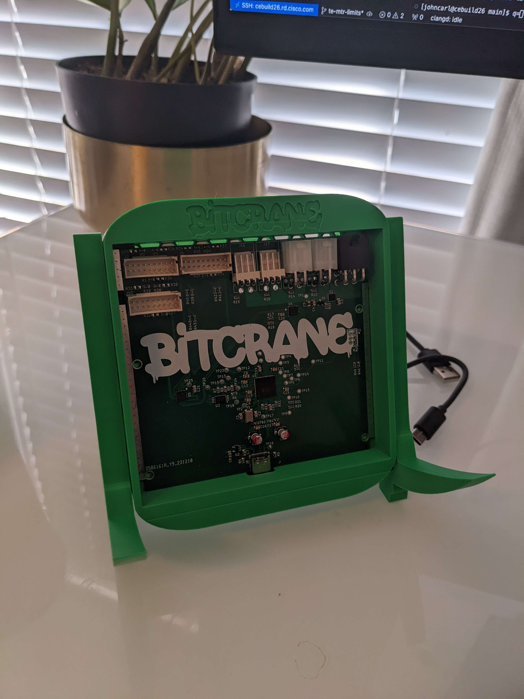

# Bitcrane

## What is this?

Introducing the Bitcrane. A quick tool to spit bytes at an Antminer hashboard over USB (and control fans & PSU).

The Bitcrane is a Control board specifically designed and engineered to replace the propiotari control boards of Antminer miners.
The Bitcrane does interact with hasboards over the standard serial cables and is been controlled via the USB-C connector and an Raspberry Pi (as an example).

With the Bitcrane will you receive the control power back to you with the open source ethos in mind.

## 🛠️ Hardware

uses the [FTDI FT4232HQ](https://ftdichip.com/products/ft4232hq/)

[DigiKey Parts List v2](https://www.digikey.com/en/mylists/list/G65P7WOTVV)
