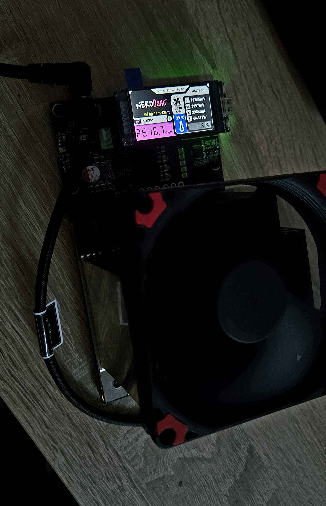

This is a **free and open source project** that lets you try to reach a bitcoin block with a small piece of hardware.
The main goal of this project is to let you **learn more about minery** and to have a beautiful piece of hardware on your desktop.

It originates from the [BitaxeUltra](https://github.com/skot/bitaxe).

NerdQAxe+ is a combination of the Nerdminer-Display and the Bitaxe Ultra (BM1366). It utilizes four the BM1366 ASIC chip and combines the Bitaxe logic with the beautiful screen of a Nerdminer. Increasing the Hashrate up to 2.5TH/s.

This project uses specifically the Lilygo T-Display S3 and a modificated QAxe+ board. It uses the GPIO Pins in order to communicate with the ASIC chip and displays all stats and necessary information on the Screen.

It comes with a modified version of AxeOs found [here](https://github.com/shufps/ESP-Miner-NerdQAxePlus).

