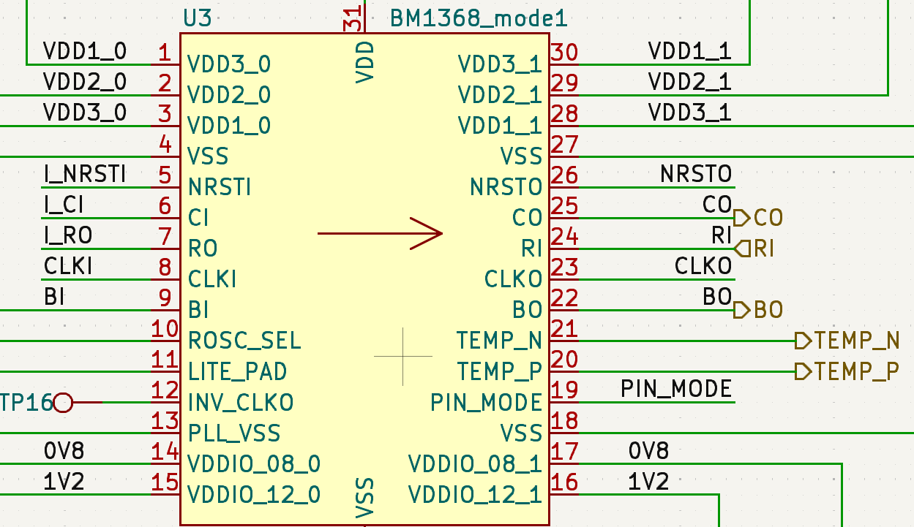

The BM1368 is an undocumented SHA256 mining ASIC from Bitmain. It's mostly used in the Antminer S21.

|                 |                                          |
| --------------- | ---------------------------------------- |
| Price           | New: ~$25 Used: ~$15 in small quantities |
| Efficiency      | ~18J/TH                                  |
| Serial Protocol | UART                                     |
| Baudrate        | -                                        |
| Footprint       | -                                        |

## Pinout

| Pinout     | Explanation                                        |
| ---------- | -------------------------------------------------- |
| VDD1_0     | Internal voltage domain 1. (for bypass capacitors) |
| VDD2_0     | Internal voltage domain 2. (for bypass capacitors) |
| VDD3_0     | Internal voltage domain 3. (for bypass capacitors) |
| VSS        | Ground                                             |
| NRSTI      | Reset input                                        |
| BI         | Busy Input                                         |
| RO         | Serial Response Output                             |
| CLKI       | Clock Input                                        |
| CI         | Serial Command Input                               |
| ADDR0      | Address 0 (unknown functionality)                  |
| ADDR1      | Address 1 (unknown functionality)                  |
| PLL_VSS    | Phase Locked Loop Ground                           |
| VDDIO_08_0 | 0.8V IO voltage                                    |
| VDDIO_18_0 | 1.8V IO voltage (this is normally 1.2V now)        |
| VDD1_1     | Internal voltage domain 1. (for bypass capacitors) |
| VDD2_1     | Internal voltage domain 2. (for bypass capacitors) |
| VDD3_1     | Internal voltage domain 3. (for bypass capacitors) |
| VSS        | Ground                                             |
| NRST0      | Reset Output                                       |
| BO         | Busy Output                                        |
| RI         | Serial Response Input                              |
| CLK0       | Clock output                                       |
| TEMP_P     | Temperature postitive diode side                   |
| TEMP_N     | Temperature negative diode side                    |
| CO         | Serial Command Output                              |
| INV_CLK0   | Inverted Clock Output (unknown use)                |
| PIN_MODE   | Pin mode selector                                  |
| VSS        | Ground                                             |
| VDI0_08_1  | 0.8V IO voltage                                    |
| VSI0_08_1  | 1.8V IO voltage (this is normally 1.2V now)        |

## Versions

It has multiple versions.
