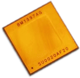

The BM1397 is an undocumented SHA256 mining ASIC from Bitmain. It's mostly used in the Antminer S17 and T17.

| | |
|-|-|
| Price | New: ~$20 Used: ~$6 in small quantities |
| Efficiency | 0.03J/GH |
| Seraial Protocol | UART |
| Baudrate | Default: 115200bps, up to 6Mbps |
| Footprint | same as BM1387 |

## Pinout
The BM1397 has two "modes", which change some of the pins to make daisy-chaining of ASICs easier.

## Versions
It has multiple versions. A Guide can be found [here](https://d-central.tech/bm1397-ad-ag-ah-ai-antminer-17-series-chip-replacement-guide/)