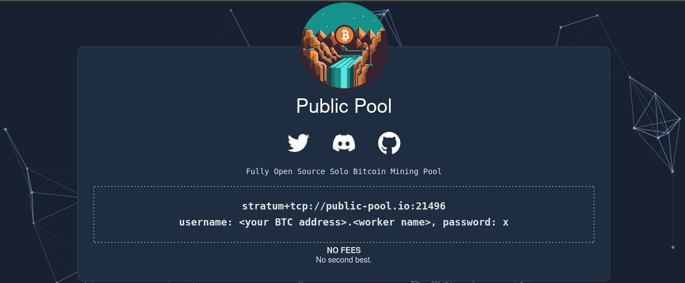

Public Pool is fully open source, solo Bitcoin mining pool. There is an official instance of the pool available at [web.public-pool.io](https://web.public-pool.io), where you can point your miners, but you also have the option to host it yourself.

The official instance is managed by [Benjamin Wilson](https://github.com/benjamin-wilson). The backend runs on hardware under his physical control, and only the GUI relies on cloud infrastructure. 

Official GitHub Repository: [Public Pool GitHub](https://github.com/benjamin-wilson/public-pool). The repository includes both the stratum server and the GUI. Contributions are welcome.

:::caution[This page is not complete yet.]
Help us to complete the wiki by using the "Edit page" button at the end of the page 👇
:::