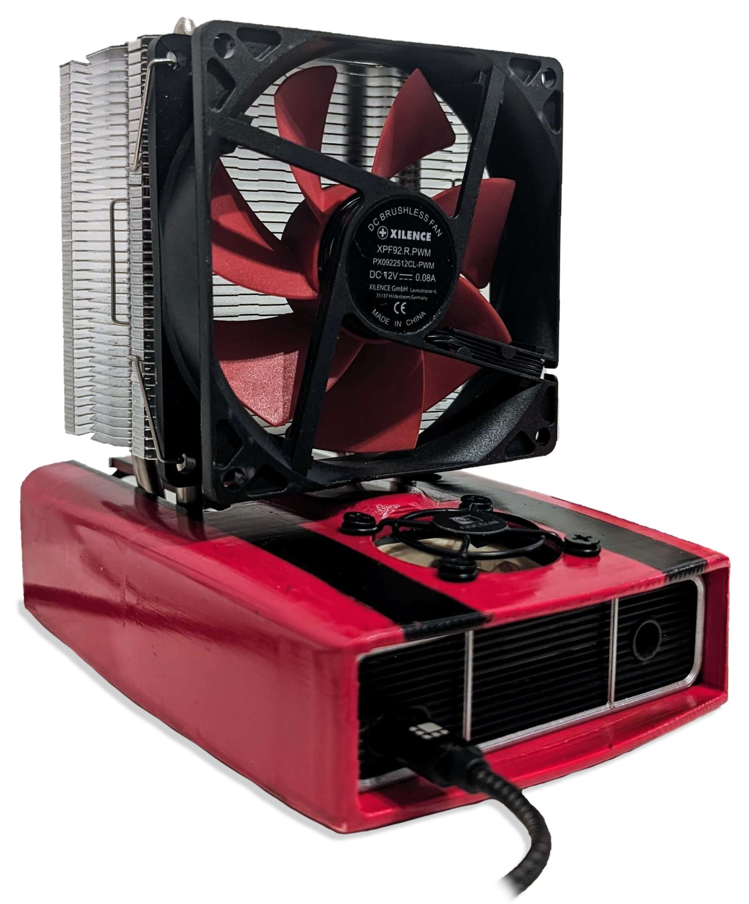

Qaxe is a quad-BM1366 Miner based on the [PiAxe](/piaxe/about) and [BitAxe](/bitaxe/about).

The Qaxe is an innovative quad-BM1366 miner, deriving its design from the PiAxe and BitAxe projects. It represents a significant step forward in ASIC Bitcoin mining technology, offering enhanced performance and efficiency. Here's a brief overview based on the information available on its GitHub repository:

### Key features and Specifications

- ASICs: Utilizes four BM1366 ASICs, providing a robust mining solution.
- Revisions:
  - **rev1:** is tested and operating at about 1.8TH/s average speed. 
  - **rev2:** working fine with the expected speed of ~1.8TH/s avg after some minor modifications (330µF caps are wrongly placed, see rev3) 
  - **rev3:** Fixed Caps placement and added Boot-Switch. It should put the STM32 into DFU bootloader but not tested yet.
- **Installation**: For programming/debugging, the Picoprobe firmware running on a Raspberry Pi Pico is recommended. Additionally, a simple, low-cost board facilitates flashing the Qaxe.
- **Compiling and Installing via CMSIS-DAP**: Detailed instructions are provided for flashing using the CMSIS-DAP adapter, including steps for installing necessary tools like curl and Rust, cloning the repository, initializing submodules, and building and running the firmware.

### Mining Client

The Qaxe Mining Client software is a advanced modified version of the origional pyminer and now been called [piaxe-miner](https://github.com/shufps/piaxe-miner).
This Python based software features the underlying process of the mining process on the PiAxe and the QAxe.

:::caution[This page is not finally written yet.]
Help us to complete the wiki by using the "Edit page" button at the end of the page 👇
:::
